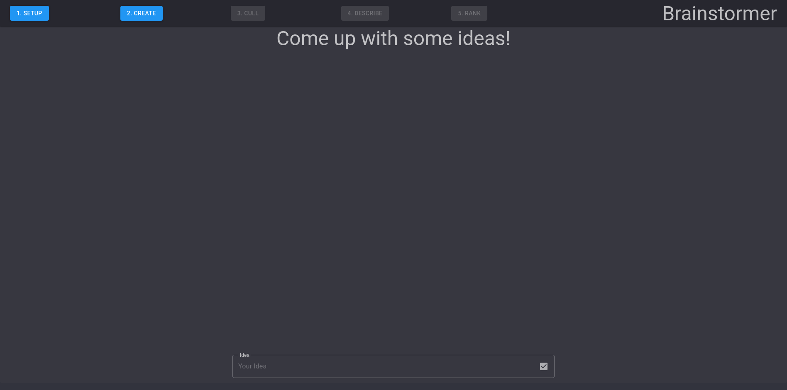

# Brainstormer

## Getting Started

**Get up and running quickly by pulling the project from docker-hub.**

if you have docker running, all you have to do is copy paste the following snippet into a terminal;

```
sudo docker run --rm -P -d -p 8080:80 -p 443:443 hackerbuddy229/brainstormer:latest
```

After this navigate to [localhost:8080](https://localhost:8080) and off you go...



### How to build

If you want to contribute you can easily build the project locally with the included dockerfile. Just pop open a terminal and follow along to get started.

```
// Fetch the repo from github
git clone github.com/hackerbuddy229/brainstormer.git
cd brainstormer/

//build the image
sudo docker build -t brainstormer:latest src

//and finally run it
sudo docker run --rm -P -d -p 8080:80 -p 443:443 hackerbuddy229/brainstormer:latest
```

### Thank you

If you found this project useful in some way please check out some of my other projects here on github or perhaps add me on your network on [linkedin](https://www.linkedin.com/in/rasmus-b-5b1019126/).
